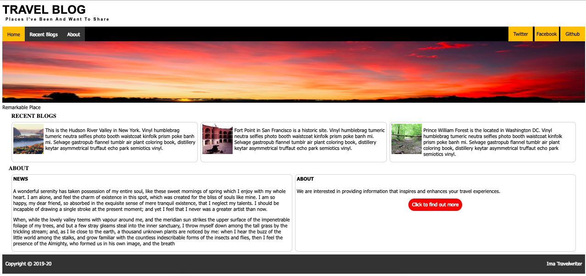

*Travel Blog*

**Introduction to HTML/CSS** 

The object of this assignment is to create a web page that looks like the image located in `images/finished-project.png`.
  

You worked through the details needed to create this in the previous assignment. 

1. Start by creating Semantic HTML
Headers  
--- nav bar  
------ internal links  
------ social links  
--- figure containing image and caption  
header "recent blogs"  
--- table layout with 1 row  
------ 3 columns each containing image with text wrapped around  
header "about"  
--- table layout with 1 row  
------ 2 columns  
--------- 1st column header + text  
--------- 2nd column header + text + button made from div  
footer  
--- 2 block items placed to the left and right  
2. Add a favicon using images/t.png
3. Add 2 different font families to the document. The picture is using 2 sans-serif fonts but you can choose any two fonts.  You can also load and use a font from fonts.google.com.
4. Create a Nav Bar that has "Home", "Recent Blogs" and "About" link to the sections within the document.  The Home page can point to the current pages using a hfre of "".
5. Use float or inline-block to create the navigation links and social links.
6. Use relative and absolute positioning to pull nav links to the left and social links to the right.
7. Add the "images/backlit-clouds.." picture and captions it with "Remarkable Place".
8. Add a "Recent Blogs" header and make sure the nav links will move to that position on click.
9. Use a 2D layout to set up 3 columns and within each column place and image and wrap text around it. The images should be 100x100 thumbnails.
10. Add an "About" header and makes sue that the nav links will move to that position on click.
11. Create 2 columns using a 2D layout.
12. In the first column create a "News" header and add new content from "content/news.txt"
13. In the second column create an "About" header and add content from "content/about.txt"
14. Add a Call to Action button.  The height of the button is 40px and the background color is read.  The buttons reads "Click to find out more".
15. Add a two chunks of text pulled left and right.  The left should be your name.
16. All characters in the h1 should be uppercase.
17. The characters in the h2 "Places I want to share" should contain extra character spacing.

Stretch
1. Use google fonts
2. Use your own pictures as long as they don't appear skewed.
3. Create your own content.

***Learning Objectives***  
1. Intro to HTML
2. Intro to CSS: external, internal, inline
3. Single page site: internal links  
4. float nav
5. float text around image
6. Semantic html
7. CSS background (image,color) 
8. Image tag/attribute alt=”” accessible
9. CSS display: block, inline-block, table
10. Box Model
11. comments /* TODO */
12. Color: nominal, hex, rgba
13. HTML Entities
14. Using lists for navigation
15. !DOCTYPE HTML 5
16. CSS code: inline vs internal vs external
17. Height and Width: CSS and attributes 

***Documentation***

[W3S HTML Element Reference](https://www.w3schools.com/html/html_elements.asp)  
[W3S HTML Element Attribute Reference](https://www.w3schools.com/html/html_attributes.asp)  
[W3S CSS References](https://www.w3schools.com/html/html_css.asp)  
[W3S CSS Color Reference](https://www.w3schools.com/html/html_colors.asp) 
[CSS Box Model](https://www.w3schools.com/css/css_boxmodel.asp) 
[Semantic HTML](https://www.w3schools.com/html/html5_semantic_elements.asp)

[W3S HTML Comments](https://www.w3schools.com/html/html_comments.asp)  
[W3S HTML Heading Elements](https://www.w3schools.com/html/html_headings.asp)  
[W3S HTML Paragraph Elements](https://www.w3schools.com/html/html_paragraphs.asp)  
[W3S HTML Links: Anchor tags ](https://www.w3schools.com/html/html_links.asp)  
[W3S HTML Lists](https://www.w3schools.com/html/html_lists.asp)  
[W3S HTML Block and Inline Elements](https://www.w3schools.com/html/html_blocks.asp)[W3S HTML Images](https://www.w3schools.com/html/html_images.asp)
[W3S HTML Layout: (Tables), Float, Flexbox, Grid](https://www.w3schools.com/html/html_layout.asp)  

[W3S HTML Class attribute](https://www.w3schools.com/html/html_classes.asp)
[W3S HTML ID attribute](https://www.w3schools.com/html/html_id.asp)

[MDN HTML Reference](https://developer.mozilla.org/en-US/docs/Web/HTML/Element)
[MDN CSS Overview](https://developer.mozilla.org/en-US/docs/Web/CSS)
[MDN CSS Reference](https://developer.mozilla.org/en-US/docs/Web/CSS/Reference)  
[MDN Images](https://developer.mozilla.org/en-US/docs/Learn/HTML/Multimedia_and_embedding/Images_in_HTML)
   
[W3S Styling Links](https://www.w3schools.com/css/css_link.asp)
[W3S CSS Float](https://www.w3schools.com/css/css_float.asp)
[W3S CSS Display](https://css-tricks.com/almanac/properties/d/display/)  

[W3S HTML Entities](https://www.w3schools.com/html/html_entities.asp)

[W3S Navbar](https://www.w3schools.com/css/css_navbar.asp)  

[Generate Dummy Text Lorem-Ipsum](http://www.blindtextgenerator.com/lorem-ipsum)

